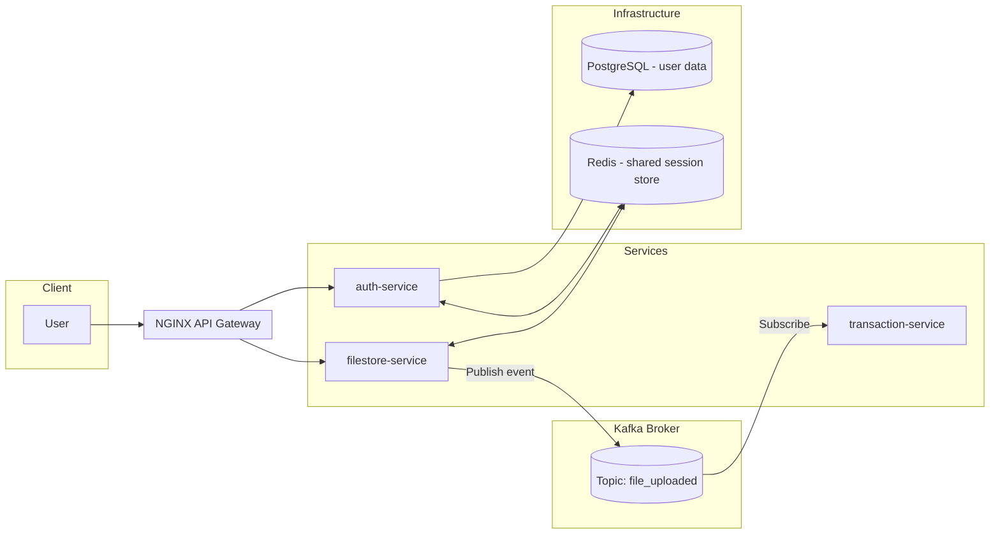

```mermaid
flowchart LR
    %% Top layer: Kafka
    subgraph Kafka["Kafka Broker"]
        K[(Topic: file_uploaded)]
    end

    %% Middle layer: Client + Gateway + Services
    subgraph Client
        U[User]
    end

    subgraph Gateway["NGINX API Gateway"]
        direction TB
    end

    subgraph Services
        direction TB
        A[auth-service]
        F[filestore-service]
        T[transaction-service]
    end

    %% Bottom layer: Infrastructure
    subgraph Infra["Infrastructure"]
        direction TB
        R[(Redis - shared session store)]
        P[(PostgreSQL - user data)]
    end

    %% Flows
    U --> Gateway
    Gateway --> A
    Gateway --> F

    A --> P
    A <--> R
    F <--> R

    F -->|Publish event| K
    K -->|Subscribe| T

```