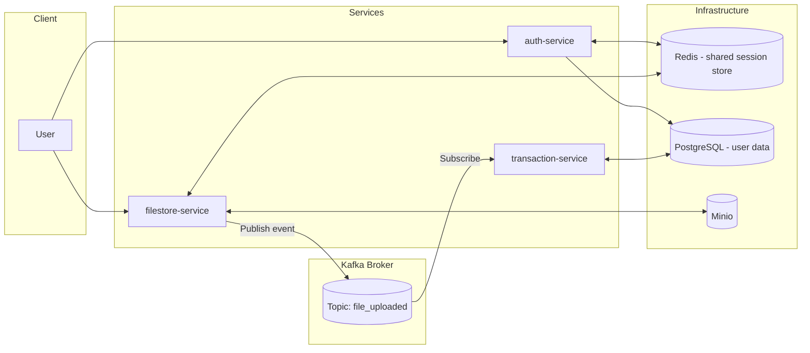

```mermaid
flowchart LR
    %% Top layer: Kafka
    subgraph Kafka["Kafka Broker"]
        K[(Topic: file_uploaded)]
    end

    %% Middle layer: Client + Gateway + Services
    subgraph Client
        U[User]
    end

    subgraph Services
        direction TB
        A[auth-service]
        F[filestore-service]
        T[transaction-service]
    end

    %% Bottom layer: Infrastructure
    subgraph Infra["Infrastructure"]
        direction TB
        R[(Redis - shared session store)]
        P[(PostgreSQL - user data)]
        M[(Minio)]
    end

    %% Flows
    U --> A
    U --> F

    A --> P
    A <--> R
    F <--> R
    F <--> M
    T <--> P

    F -->|Publish event| K
    K -->|Subscribe| T

```